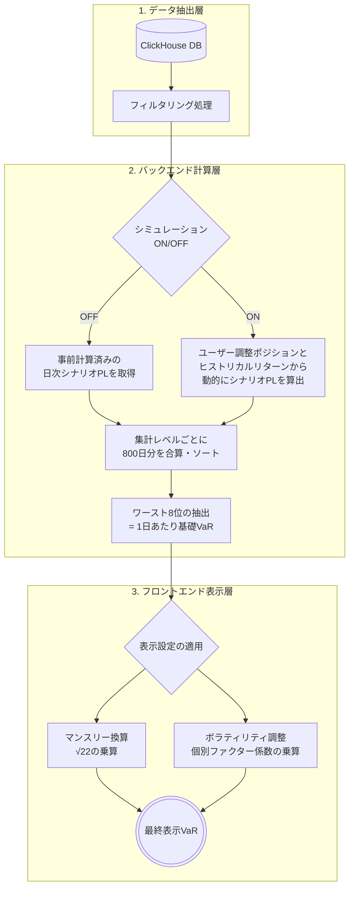
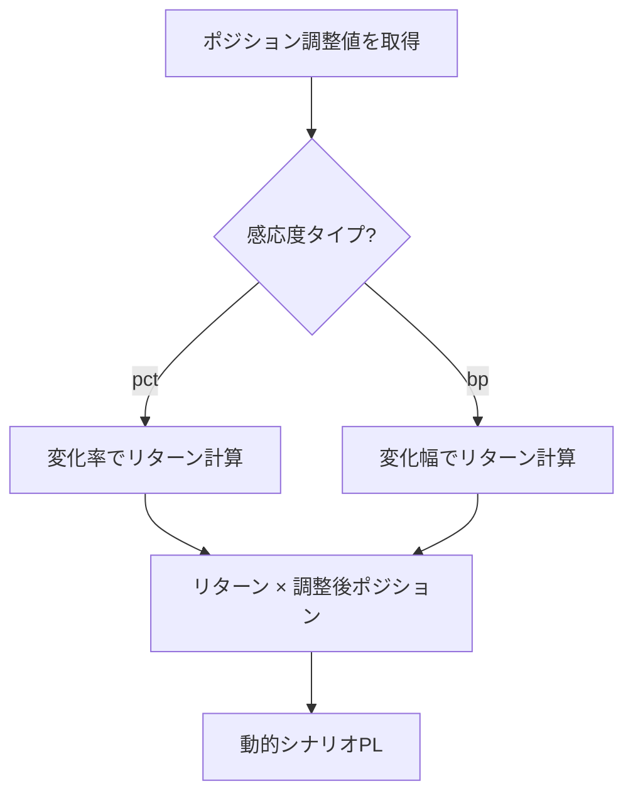
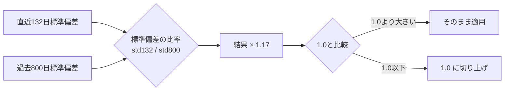

# Value at Risk (VaR) 計算ロジック・仕様定義書

本ドキュメントは、ダッシュボード上で表示されるVaR（Value at Risk）の算出ロジックを体系的にまとめた仕様書です。
金融工学的な観点とシステム実装（バックエンドの集計・フロントエンドの動的補正）の観点から、条件分岐をMECE（漏れなくダブりなく）に整理しています。

---

## 1. 前提条件と基本方針

本システムにおけるVaR計算は、以下の基本パラメータに基づく**ヒストリカル・シミュレーション法（HS法）**を採用しています。

* **信頼水準**: `99%` （100日に1回の確率で発生する最大損失額）
* **観測期間**: `800営業日` （過去約3年強の市場データを使用）
* **保有期間**: 基本は `1日` （UI操作により `1ヶ月(22営業日)` にスケーリング可能）

---

## 2. 計算処理の全体フロー

データベースから取得した生のポジション・価格データが、最終的にUIに表示されるまでの全体像は以下の通りです。

---

## 3. 基本設定トグルの組み合わせによる計算パターン（2×2マトリクス）

計算の根幹となるデータソースと算出方法は、「シミュレーショントグル（What-If）」と「フロント閲覧用トグル（日報デルタの優先）」のON/OFFの組み合わせによって **4つのパターン** に分岐します。

| シミュレーション | 日報デルタ優先 | シナリオPLの算出方法 | ベースとなるデータソース | Add-on VaR の適用 | 用途・備考 |
| :---: | :---: | :--- | :--- | :---: | :--- |
| **OFF** | **OFF** | 事前計算済みのDB値を そのまま使用 | システムの標準バッチで 計算された正規データ | **適用する** | ミドルオフィス向けの**公式な日次VaR**（デフォルト状態） |
| **OFF** | **ON** | 事前計算済みのDB値を そのまま使用 | 手動インポートされた 日報データを優先して採用 | 適用しない | **フロントオフィス閲覧用**。日中の手動修正データが反映された状態 |
| **ON** | **OFF** | **動的計算** (ヒストリカルリターン × ユーザー調整後ポジション) | システム標準データ ＋ 画面入力のポジション調整値 | 適用しない | ミドル公式データをベースにした **What-If シミュレーション** |
| **ON** | **ON** | **動的計算** (ヒストリカルリターン × ユーザー調整後ポジション) | 手動インポート優先データ ＋ 画面入力のポジション調整値 | 適用しない | フロント閲覧データをベースにした **What-If シミュレーション** |

*(※ Add-on VaR: 特定ターミナル向けに別途算出されたリスク量。公式VaRを算出する一番左上のパターンでのみ全体VaRに合算されます)*

---

## 4. データの抽出とフィルタリング詳細

前述のパターンのほかに、以下の条件でも対象データを絞り込みます。

### 4.1. 部署・商品フィルタ (`branch_filters`)
ユーザーが画面上部で選択した対象（例: 「バンキング全体」「投資ポート全体」「円株」など）に応じてデータをフィルタリングします。内部的には `entity_name`, `dept_name`, `section_code` の論理積(AND)を論理和(OR)で繋いで判定します。

<b>【詳細】計算から除外される特定アセット (ハードコード条件)</b>

特定の戦略や管理対象外の商品については、計算プロセスから完全に除外するビジネスロジックが組み込まれています。
<ul>
  <li><b>株式インデックス関連</b>: 特定部署の <code>Equity Index ETF</code>, <code>Equity Index Futures</code>, <code>Listed Equity Index Options</code></li>
  <li><b>モーゲージ関連</b>: 特定部署の <code>MBS General</code></li>
  <li><b>ヘッジ目的の金利スワップ</b>: ALM Operationの <code>IRS</code></li>
  <li><b>インフレ連動債</b>: <code>Inflation Linked Bonds</code></li>
</ul>

---

## 5. シナリオPLの算出詳細（シミュレーションON時）

シミュレーションONのパターンの場合、動的にシナリオPLを再計算するプロセスに入ります。

<b>【詳細】感応度(Sensitivity Type)に基づくリターン計算式</b>

商品の特性（株価のように比率で動くか、金利のように差幅で動くか）に応じ、過去価格（当日価格と前日価格）からリターンを算出するロジックが分岐します。

1. <b><code>pct</code>（パーセント）の場合</b>: 株式、為替、コモディティなど
   * <code>(当日価格 ÷ 前日価格) - 1</code>
2. <b><code>bp</code>（ベーシスポイント）の場合</b>: 金利、クレジットなど
   * 基本: <code>(当日価格 - 前日価格) × 10,000</code>
   * <i>※例外ルール</i>: ファクター名が <code>Gov_FutureBasis</code> で始まる場合は、取引単位の仕様により <code>× 100</code> となります。

---

## 6. 基礎VaRの抽出（パーセンタイル計算）

算出された800日分の日次シナリオPLを用いて、以下のロジックで「1日あたりの基礎VaR」を決定します。

1. **集計レベルごとの合算**:
   「全体ポートフォリオ」「カテゴリ（金利、株など）」「個別ファクター（米金利など）」の3階層それぞれで、同日の損益を合算します。
2. **ワーストシナリオの抽出**:
   800日分の日次損益を、**損失額が大きい順（数値の昇順）**にソートします。
   99%の信頼水準を満たすため、下位1%に該当する**ワースト8番目（`rn == 8`）の日の損益額**を抽出し、これを基礎VaRと定義します。

---

## 7. フロントエンドでの表示調整 (マルチプライヤー)

バックエンドが算出した「1日あたりの基礎VaR」に対して、画面の「表示設定」トグルの状態に応じた補正係数（マルチプライヤー）を適用します。これにより、DBに負荷をかけることなく即座に表示が切り替わります。

### 7.1. マンスリーVaR換算 (`useMonthlyVar`)
リスク管理上、月次のリミット対比でモニタリングを行うための時間換算ロジックです。
* **計算式**: `1日あたりVaR × √22` （1ヶ月を22営業日と仮定した平方根ルールによるスケーリング）
* **適用先**: 全体のVaR、各カテゴリ・ファクターのVaR、増減額すべてに一律適用。

### 7.2. ボラティリティ調整係数 (`useVolatilityAdjustment`)
ヒストリカル法（800日）の弱点である「直近の急激な相場変動（ボラティリティ・スパイク）への反応の遅さ」を補正するためのビジネスロジックです。

* **適用粒度**: バックエンドの専用APIで「全体」「カテゴリ別」「ファクター別」それぞれの標準偏差から**独立した個別の係数**を算出し、対応する階層のVaRにピンポイントで乗算します。
* **フロア処理**: 算出された係数が `1.0` を下回る（直近相場が平穏である）場合は、リスクの過小評価を防ぐため係数を `1.0` とします。

---

## 8. 付帯するビジネスロジック

ダッシュボード上での表現を豊かにするための付随ロジックです。

<b>【詳細】リスクの方向性（Risk Direction）の判定</b>

資産別テーブルで表示される「低下/上昇」「拡大/縮小」などのリスク要因の方向性は、そのファクターの<b>デルタの合計値（<code>dsum</code>）</b>の極性（正か負か）によって判定されます。

| 資産カテゴリ | デルタがプラス (`>= 0`) | デルタがマイナス (`< 0`) |
| :--- | :--- | :--- |
| **金利** | 低下 (赤・ネガティブ) | 上昇 (緑・ポジティブ) |
| **クレジット・為替** | 縮小 (赤) | 拡大 (緑) |
| **株・コモディティ・不動産** | 下落 (赤) | 上昇 (緑) |

※ デルタデータが存在しない場合は、ベガ（オプションのボラティリティ・リスク）の合計値（<code>vsum</code>）を代替として判定に使用します。

